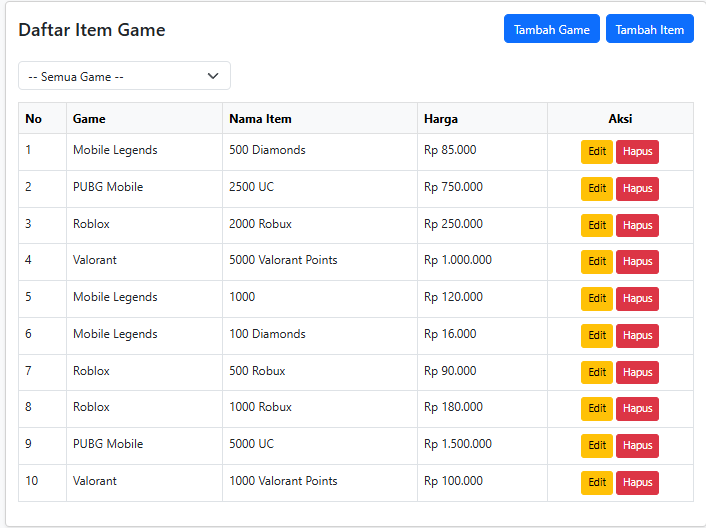
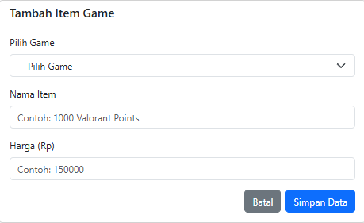
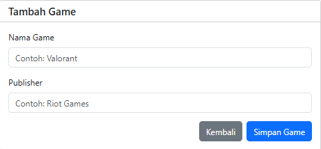
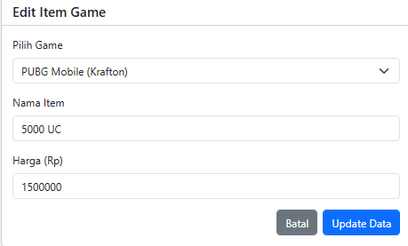

#Aplikasi Manajemen Item Game


**Posisi yang dilamar:** Backend Developer 

---

## 💡 Tema & Deskripsi Singkat
Tema aplikasi yang diangkat pada proyek ini adalah Katalog Layanan Top Up Game. Aplikasi berbasis web ini dirancang layaknya etalase digital untuk mengelola daftar paket mata uang virtual (seperti VP, Tokens, atau Robux) dari berbagai judul game yang tersedia.

## 🛠️ Framework & Library yang Digunakan
- **Framework:** Laravel 13.17.0
- **Bahasa:** PHP v8.3
- **Composer:** v2.9.7
- **Database:** MySQL
- **Styling:** Bootstrap v5 (via CDN)

## ⚙️ Langkah Instalasi
Ikuti langkah-langkah berikut untuk menjalankan aplikasi ini di komputer lokal:

1. Clone repository ini

   ```bash
   git clone [https://github.com/Frmndz/Katalog_TopUpGames.git]
   cd [Katalog_TopUpGames]
   ```
   
2. Install dependensi PHP

    ```bash
    composer install
    ```

3. Siapkan file Environment
   Salin file .env.example menjadi .env.

   ```bash
   cp .env.example .env
   ```

4. Konfigurasi Database
   Buka file .env, lalu sesuaikan kredensial database Anda (Pastikan Anda sudah membuat database kosong bernama katalog_db di MySQL).

   ```bash
   Cuplikan kode
    DB_CONNECTION=mysql
    DB_HOST=127.0.0.1
    DB_PORT=3306
    DB_DATABASE=db_game_items
    DB_USERNAME=root
    DB_PASSWORD=
    ```

5.  Generate Application Key
    ```bash
    php artisan key:generate
    ```

6.  Jalankan Migrasi Database
    Perintah ini akan membuat struktur tabel beserta relasinya.

    ``Bash
    php artisan migrate
    ```

7.  Jalankan Server Lokal

    ```Bash
    php artisan serve
    ```

    🌐 Cara Mengakses Aplikasi
    Setelah server berjalan, aplikasi dapat diakses melalui web browser pada URL dan port default berikut:
    http://127.0.0.1:8000


    📸 Tangkapan Layar
    

    

    

    